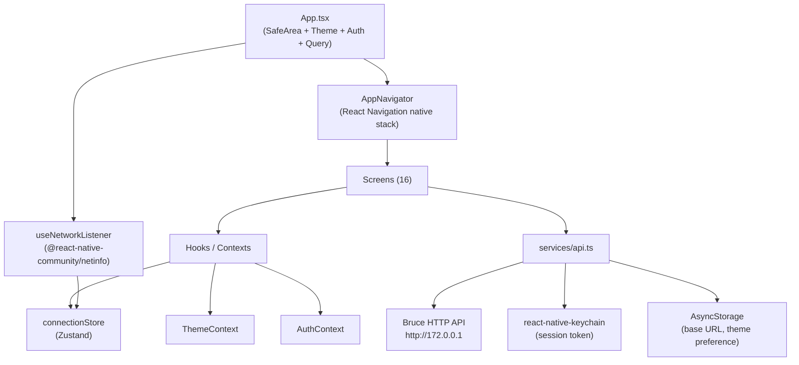

# BruceLink — Technical Documentation

## Contents

1. [What It Is](#1-what-it-is)
2. [Architecture](#2-architecture)
3. [Repository Layout](#3-repository-layout)
4. [Screens](#4-screens)
5. [State and Data Flow](#5-state-and-data-flow)
6. [API Surface](#6-api-surface)
7. [Command System](#7-command-system)
8. [Theme System](#8-theme-system)
9. [Development](#9-development)
10. [Testing](#10-testing)
11. [Release Workflow](#11-release-workflow)
12. [Troubleshooting](#12-troubleshooting)

---

## 1. What It Is

BruceLink is an Android React Native app (v0.84.1, New Architecture) that controls a [Bruce firmware](https://github.com/pr3y/Bruce) device over its local WiFi AP.

The target hardware is an ESP32-S3 N16R8 (Smoochie Board) running Bruce firmware v1.14. The app communicates exclusively over HTTP to the device's built-in web server. There is no BLE, no cloud, no backend.

**What it does:**

- Authenticates and maintains a session cookie against the Bruce WebUI
- Reads device info, SD and LittleFS storage stats
- Browses, edits, uploads, downloads, and executes files on SD/LittleFS
- Sends typed firmware commands via `/cm` for every hardware module: RF/Sub-GHz, IR, RFID/NFC, BLE, NRF24, WiFi, GPS
- Streams the device navigator screen via `/getscreen` WebView canvas
- Configures device settings: brightness, sleep, screen color, factory reset
- Detects WiFi disconnection and shows a persistent offline banner

**Target Firmware Limitations & Phase 2:**

BruceLink is currently constrained by the stock `v1.14` firmware architecture. The stock firmware uses a **Presentation Layer**, meaning it renders live data (like BLE lists or GPS coordinates) directly to the physical TFT screen instead of serving it as JSON data. 

To ensure complete crash-prevention and stability over HTTP, the app strictly uses a "Smart Remote" and File-Manager pattern. Complex data features do not have native mobile screens; instead, they are navigated via a live screen capture of the physical device (`/getscreen`). 

**Future Roadmap (Phase 2):** To build true, native React Native interfaces for BLE, NRF24, WiFi, and GPS, a custom branch of the Bruce C++ firmware must be developed. By implementing dedicated JSON API endpoints (`/api/ble/scan`), the physical restrictions will be completely bypassed.

---

## 2. Architecture



### Layers

| Layer | Path | Responsibility |
|---|---|---|
| Entry point | `App.tsx` | Provider tree: SafeArea → Theme → Auth → Query → Navigator |
| Navigation | `src/navigation/AppNavigator.tsx` | Typed native stack, all 16 screens with ErrorBoundary wrappers |
| Screens | `src/screens/` | Orchestrate state, dispatch commands, render UI |
| Components | `src/components/` | Reusable UI: OfflineBanner, StateContainer, FileItem, StorageBar, etc. |
| Hooks | `src/hooks/` | useFileList, useFileContent, usePermissions, useNetworkListener, useDeviceInfo |
| Contexts | `src/contexts/` | AuthContext (session state), ThemeContext (theme tokens + mode) |
| Services | `src/services/` | api.ts (HTTP), commands.ts (command builders), secureStorage.ts (Keychain) |
| Stores | `src/stores/` | connectionStore (Zustand): connection status machine |
| Types | `src/types/firmware.ts` | Single source of truth for all firmware types, command params, navigation params |
| Utils | `src/utils/` | sanitize.ts, fileHelpers.ts, constants.ts |
| Theme | `src/theme/tokens.ts` | Immutable light/dark token objects (colors, spacing, radius, typography) |

---

## 3. Repository Layout

```text
.
├── App.tsx                        # App entry: provider tree + offline banner
├── index.js
├── android/                       # Android native project
├── scripts/
│   ├── android-release-build.sh   # APK build + naming
│   ├── changelog-post-commit.sh   # Auto-changelog hook
│   ├── install-changelog-hook.sh  # Install the git hook
│   └── mock-access-point.js       # Local Bruce API mock server
├── src/
│   ├── assets/                    # fonts, images, navigator HTML canvas
│   ├── components/                # Reusable UI components
│   ├── contexts/                  # AuthContext, ThemeContext
│   ├── hooks/                     # Custom hooks
│   ├── navigation/                # AppNavigator.tsx
│   ├── providers/                 # QueryProvider (TanStack Query)
│   ├── screens/                   # All screen components
│   ├── services/                  # api.ts, commands.ts, secureStorage.ts, commandQueue.ts
│   ├── stores/                    # connectionStore.ts (Zustand)
│   ├── theme/                     # tokens.ts
│   ├── types/                     # firmware.ts (canonical), index.ts (re-exports)
│   └── utils/                     # sanitize.ts, fileHelpers.ts, constants.ts, bruceSystemUi.ts
├── __tests__/                     # Jest test suites mirroring src structure
├── patches/                       # patch-package patches
├── docs/
│   └── ai/                        # AI governance and implementation docs
├── CHANGELOG.md
├── DOCUMENTATION.md
└── README.md
```

---

## 4. Screens

| Screen | Route | Description |
|---|---|---|
| `LoginScreen` | `Login` | URL input + credential auth; stores session in Keychain |
| `DashboardScreen` | `Dashboard` | Firmware version, storage bars, module quick-launch grid |
| `FileExplorerScreen` | `FileExplorer` | SD/LittleFS browser; list, upload, download, delete, rename |
| `FileEditorScreen` | `FileEditor` | Text editor for files on device; save and execute support |
| `TerminalScreen` | `Terminal` | Free-form command input with sanitization and history |
| `NavigatorScreen` | `Navigator` | Full-screen WebView canvas streaming `/getscreen`; nav controls |
| `SettingsScreen` | `Settings` | Brightness, sleep, screen color, factory reset, reboot, logout |
| `PayloadRunnerScreen` | `PayloadRunner` | Lists and executes scripts from `/scripts` on SD |
| `SubGhzScreen` | `SubGhz` | CC1101 Sub-GHz: capture, transmit, frequency scan, file player |
| `InfraredScreen` | `Infrared` | IR TX/RX: capture, transmit (NEC/SIRC/RC5/RC6/Samsung32), TV-B-Gone, file player |
| `RfidNfcScreen` | `RfidNfc` | PN532: read tag, clone, NDEF write, browse NFC/Mifare/Amiibo files |
| `BleScreen` | `Ble` | BLE scan, spam (iOS/Android/Samsung/Windows/All), Bad BLE Ducky execution |
| `Nrf24Screen` | `Nrf24` | NRF24L01+: spectrum analysis, 2.4GHz jammer, Mousejack |
| `WifiAttackScreen` | `WifiAttack` | WiFi recon (ARP, sniffer, listen), attacks (deauth, beacon spam, evil portal, karma), wardriving |
| `GpsScreen` | `Gps` | Live fix/satellite status, lat/lon/alt/speed tracking, wardriving, Wigle upload |

> `NavigatorWebCanvas` is a sub-component co-located with `NavigatorScreen`, not a route.

---

## 5. State and Data Flow

### Auth flow

1. `LoginScreen` calls `api.login(url, user, pass)` → `POST /login`.
2. Session cookie (`BRUCESESSION`) extracted from response headers or `CookieManager`.
3. Token stored via `secureStorage.setToken()` (react-native-keychain — OS Keystore on Android).
4. `AuthContext` reads token on mount; sets `authState` to `authenticated` or `unauthenticated`.
5. Axios interceptor on 401: calls `notifyUnauthorized()` → `AuthContext` clears state → navigator redirects to Login.

### Connection state machine

`src/stores/connectionStore.ts` (Zustand):

```
idle → connecting → connected
             ↓
        disconnected
             ↓
           error
```

`useNetworkListener` (mounted in `App.tsx`) subscribes to NetInfo. When `isConnected === false` and store status is `connected` or `connecting`, it calls `disconnect()`. `OfflineBanner` renders when status is `disconnected` or `error`.

### Async data fetching

- `useFileList(fs, path)` — fetches directory listings via `api.listFiles()`.
- `useFileContent(fs, path)` — fetches raw file content via `api.getFileContent()`.
- `useDeviceInfo()` — fetches `/systeminfo`.
- All hooks expose `{ data, isLoading, isError, refetch }`. Screens use `StateContainer` to render loading/error/empty/success states.

### Input sanitization

All command strings pass through `sanitizeCommand()` before hitting `/cm`. Path inputs pass through `sanitizePath()`. Both live in `src/utils/sanitize.ts`.

---

## 6. API Surface

Base URL configured in-app. Default: `http://172.0.0.1`.

| Method | Endpoint | Params | Purpose |
|---|---|---|---|
| `POST` | `/login` | `user`, `password` (form) | Start session, sets `BRUCESESSION` cookie |
| `GET` | `/logout` | — | End session |
| `GET` | `/systeminfo` | — | Returns `{ BRUCE_VERSION, SD, LittleFS }` |
| `GET` | `/listfiles` | `fs`, `dir` | List files and folders |
| `GET` | `/file` | `fs`, `dir`, `filename`, `action` | Read / download / delete / create |
| `POST` | `/upload` | multipart `file`, `path` | Upload file to device |
| `POST` | `/rename` | `path`, `newName` | Rename file or folder |
| `POST` | `/edit` | `file`, `content` | Save file content |
| `POST` | `/cm` | `cmd` (form) | Execute firmware command; returns text response |
| `GET` | `/wifi` | `apssid`, `appasswd` | Update WebUI AP credentials |
| `GET` | `/reboot` | — | Reboot device |
| `GET` | `/getscreen` | — | Navigator screen stream (used by WebView) |

Full endpoint details: `docs/bruce_firmware_api_docs.md`.

---

## 7. Command System

All firmware CLI commands are built through typed builder functions in `src/services/commands.ts`. No screen constructs a raw command string directly.

Modules: `rf`, `ir`, `wifi`, `loader`, `nav`, `power`, `screen`, `sound`, `storage`, `badusb`, `interpreter`, `gpio`, `crypto`, `settings`, `util`.

Examples:

```ts
import { rf, ir, wifi } from '../services/commands';

rf.rx({ frequency: 433920000 })       // → 'rf rx -f 433920000'
ir.tx({ protocol: 'NEC', address: '0x00', command: '0x0C' }) // → 'ir tx NEC 0x00 0x0C'
wifi.deauth()                          // → 'deauth'
```

All builders validate parameters and return strings that are safe to pass to `sendCommand()`.

---

## 8. Theme System

`src/theme/tokens.ts` exports `THEME_TOKENS` with `light` and `dark` objects. Each contains:

- `colors` — background, surface, text, primary, error, warning, border, etc.
- `spacing` — `xs` through `jumbo` (numeric px values)
- `radius` — `sm`, `md`, `lg`, `xl`
- `typography` — `regular`, `mono`, `pixel` font families

Screens and components consume tokens via `useTheme()` from `ThemeContext`, then pass the result to a `makeStyles(theme)` factory:

```ts
const theme = useTheme();
const s = makeStyles(theme);
// s.card, s.primaryBtn, etc.
```

No component imports `COLORS` directly from constants for UI rendering. `COLORS` in constants is a static snapshot used only in `AppNavigator` screen header options.

Theme preference (`light` / `dark` / `system`) is persisted in AsyncStorage and restored on mount.

---

## 9. Development

### Prerequisites

- Node.js >= 22.11.0
- JDK 17
- Android SDK (API 24+)
- `ANDROID_HOME` set to SDK path (or use Android Studio defaults)

### Commands

```bash
npm install          # install dependencies (runs patch-package postinstall)
npm start            # Metro bundler
npm run android      # build + deploy debug to connected device/emulator
npm run mock:ap      # start local Bruce API mock on http://localhost:3000
npm run lint         # eslint
npx tsc --noEmit     # type-check
```

### Mock AP

`scripts/mock-access-point.js` runs an Express server with stubbed Bruce endpoints. Useful when no physical device is available. Point the app's base URL to `http://10.0.2.2:3000` (emulator) or `http://localhost:3000` (device via USB tunnel).

### Changelog hook

```bash
npm run hooks:install:changelog
```

Installs a post-commit git hook that appends entries to `CHANGELOG.md` when commits touch `src/**`, `android/**`, `App.tsx`, `__tests__/**`, or release/mock scripts. Docs-only commits are skipped.

---

## 10. Testing

```bash
npm test                          # all tests
npm test -- --testPathPattern=screens   # specific folder
npm test -- --no-coverage --forceExit  # fast, no coverage report
npx tsc --noEmit                  # type errors
```

### Structure

```text
__tests__/
├── App.test.tsx
├── cleanup/          # dead code assertions
├── components/       # ErrorBoundary, OfflineBanner, StateContainer, StorageBar, ThemeModeSelector
├── hooks/            # useAuth, useNetworkListener, usePermissions
├── navigation/       # AppNavigator route registration
├── screens/          # source contract tests for all 16 screens
├── scripts/          # changelog hook, mock AP behavior
├── services/         # api.ts, commands.ts, secureStorage.ts
├── stores/           # connectionStore state machine
├── theme/            # tokens, themeMode, useTheme
└── utils/            # sanitize, fileHelpers
```

### What the tests cover

- Source contract tests for every screen: verify imports, no raw COLORS references, correct command builder usage, required UI sections
- State machine transitions in `connectionStore`
- Every command builder in `commands.ts`
- Sanitizer edge cases in `sanitize.ts`
- Secure storage read/write/clear via mocked Keychain
- OfflineBanner visibility rules
- StateContainer rendering all four states (loading/error/empty/success)
- Permission request flow (granted, denied, already granted)

### Global mocks (jest.setup.js)

- `@react-native-async-storage/async-storage` — uses the official async-storage mock
- `react-native-keychain` — `setGenericPassword`, `getGenericPassword`, `resetGenericPassword`
- `react-native-vector-icons/MaterialCommunityIcons` — renders a stub `<Icon>` element
- `@react-native-community/netinfo` — stubs `addEventListener` and `fetch`

---

## 11. Release Workflow

Release builds are produced by `scripts/android-release-build.sh`. The build code is derived from the semver: `MAJOR * 10000 + MINOR * 100 + PATCH`.

```bash
npm run android:release        # npm version patch, then build
npm run android:release:minor  # npm version minor, then build
npm run android:release:major  # npm version major, then build
npm run android:release:build  # build only, no version bump
```

Output: `android/app/build/outputs/apk/release/BruceLink-v<version>-build<code>-release.apk`

Debug APK: `android/app/build/outputs/apk/debug/app-debug.apk`

---

## 12. Troubleshooting

**Android build fails with Java toolchain error**

Ensure `JAVA_HOME` points to JDK 17. The npm scripts set it to `/opt/android-studio/jbr` by default — override if your path differs. Check `android/build/reports/problems/problems-report.html` for detail.

**Emulator cannot reach the device AP**

Android emulators run on an isolated virtual network. Either:
- Use a physical device connected to the same WiFi AP as the Bruce device
- Use `npm run mock:ap` and point the app to `http://10.0.2.2:3000`

**Type errors after installing a new dependency**

```bash
npx tsc --noEmit
npm test -- --runInBand
```

If the error is in a library's own types (e.g. `@types/react-native-vector-icons`), add `--skipLibCheck` to `tsconfig.json` `compilerOptions`.

**Session lost after app restart**

The session token is stored in the OS Keystore via `react-native-keychain`. If `getGenericPassword` returns `false`, no stored session exists — the login screen will show. This is expected behavior after a factory reset or app data clear.

**Test suite imports fail after `npm install`**

Run `npm run postinstall` (or `npx patch-package`) to re-apply patches in `/patches/`. The `@react-native-cookies/cookies` patch is required.
