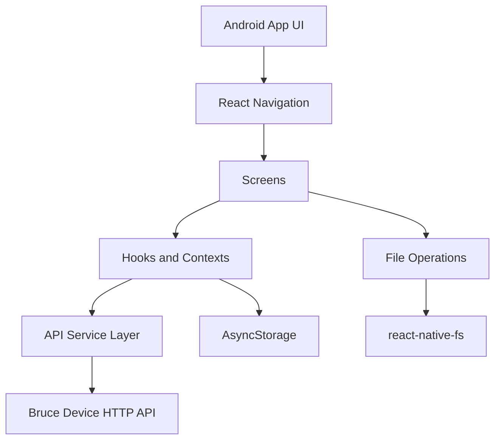

# BruceLink Documentation

## 1. Overview

BruceLink is an Android-only React Native application that connects to Bruce firmware devices over local WiFi.

The app provides:

- Authentication against the Bruce WebUI
- Device health and storage overview
- File system browsing and editing for SD/LittleFS
- Command execution and navigator controls
- Device settings and session management

## 2. Runtime Architecture



### 2.1 Key Layers

- UI layer: `src/screens/`, `src/components/`
- State/context layer: `src/contexts/`, `src/providers/`
- Integration layer: `src/services/api.ts`
- Utility layer: `src/utils/`, `src/theme/`

## 3. Repository Layout

```text
.
├── App.tsx
├── android/
├── scripts/
├── src/
│   ├── assets/
│   ├── components/
│   ├── contexts/
│   ├── hooks/
│   ├── navigation/
│   ├── providers/
│   ├── screens/
│   ├── services/
│   ├── theme/
│   ├── types/
│   └── utils/
├── __tests__/
├── CHANGELOG.md
├── DOCUMENTATION.md
└── README.md
```

## 4. Local Development

## 4.1 Prerequisites

- Node.js `>= 22.11.0`
- npm
- JDK 17
- Android SDK + emulator/device

## 4.2 Install and Run

```bash
npm install

# terminal 1
npm start

# terminal 2
npm run android
```

## 4.3 Useful Scripts

```bash
npm test
npx tsc --noEmit
npm run lint
npm run mock:ap
```

## 5. Release Workflow

BruceLink uses version-driven APK naming where build code is derived from semantic version.

## 5.1 Standard Release Commands

```bash
npm run android:release        # patch bump + release build
npm run android:release:minor  # minor bump + release build
npm run android:release:major  # major bump + release build
npm run android:release:build  # build only (no bump)
```

## 5.2 Release Artifact

Output location:

- `android/app/build/outputs/apk/release/BruceLink-v<version>-build<code>-release.apk`

## 6. API Surface Summary

Base URL is configured in-app (commonly `http://172.0.0.1`).

| Method | Endpoint | Purpose |
|---|---|---|
| `POST` | `/login` | Start session and set cookie |
| `GET` | `/logout` | End session |
| `GET` | `/systeminfo` | Device and storage info |
| `GET` | `/listfiles` | List files/folders |
| `GET` | `/file` | Read/download/delete/create operations via query args |
| `POST` | `/upload` | Upload file |
| `POST` | `/rename` | Rename file/folder |
| `POST` | `/edit` | Save file content |
| `POST` | `/cm` | Execute command |
| `GET` | `/wifi` | Update WebUI credentials |
| `GET` | `/reboot` | Reboot device |
| `GET` | `/getscreen` | Navigator stream |

For endpoint-level details, see `docs/bruce_firmware_api_docs.md`.

## 7. Testing Strategy

## 7.1 Automated

- Unit/integration tests under `__tests__/`
- Script behavior tests under `__tests__/scripts/`
- Theme and UI behavior tests under `__tests__/theme/` and `__tests__/components/`

## 7.2 Manual Validation Checklist

- Login succeeds against Bruce AP
- Dashboard returns system info
- File explorer list/edit/download flows work
- Terminal command executes and returns output
- Navigator stream renders and navigation controls respond
- Settings actions (credentials/reboot/logout/theme) behave as expected

## 8. Changelog Policy

`CHANGELOG.md` has an automated post-commit section under `<!-- AUTO-CHANGELOG-ENTRIES -->`.

The automation now appends entries only when a commit touches mobile-app related files, including:

- `src/**`, `android/**`, `App.tsx`, `index.js`, config files
- mobile test paths (`__tests__/**`)
- mobile release/mock scripts (`scripts/android-release-build.sh`, `scripts/mock-access-point.js`)

Commits that only change docs/governance files are skipped by the auto-entry hook.

## 9. Troubleshooting

## 9.1 Android build fails due Java toolchain

- Use JDK 17
- Re-run release command via provided npm scripts
- Check `android/build/reports/problems/problems-report.html`

## 9.2 Emulator cannot reach device AP

- Verify emulator network route and AP reachability
- Use mock server for local UI iteration:

```bash
npm run mock:ap
```

## 9.3 Type errors after dependency changes

```bash
npx tsc --noEmit
npm test -- --runInBand
```

## 10. Maintenance Notes

- Keep README high-level and direct deeper details to this file.
- Keep `CHANGELOG.md` focused on product/mobile-impacting entries.
- Add/refresh tests whenever automation scripts or core flows change.
